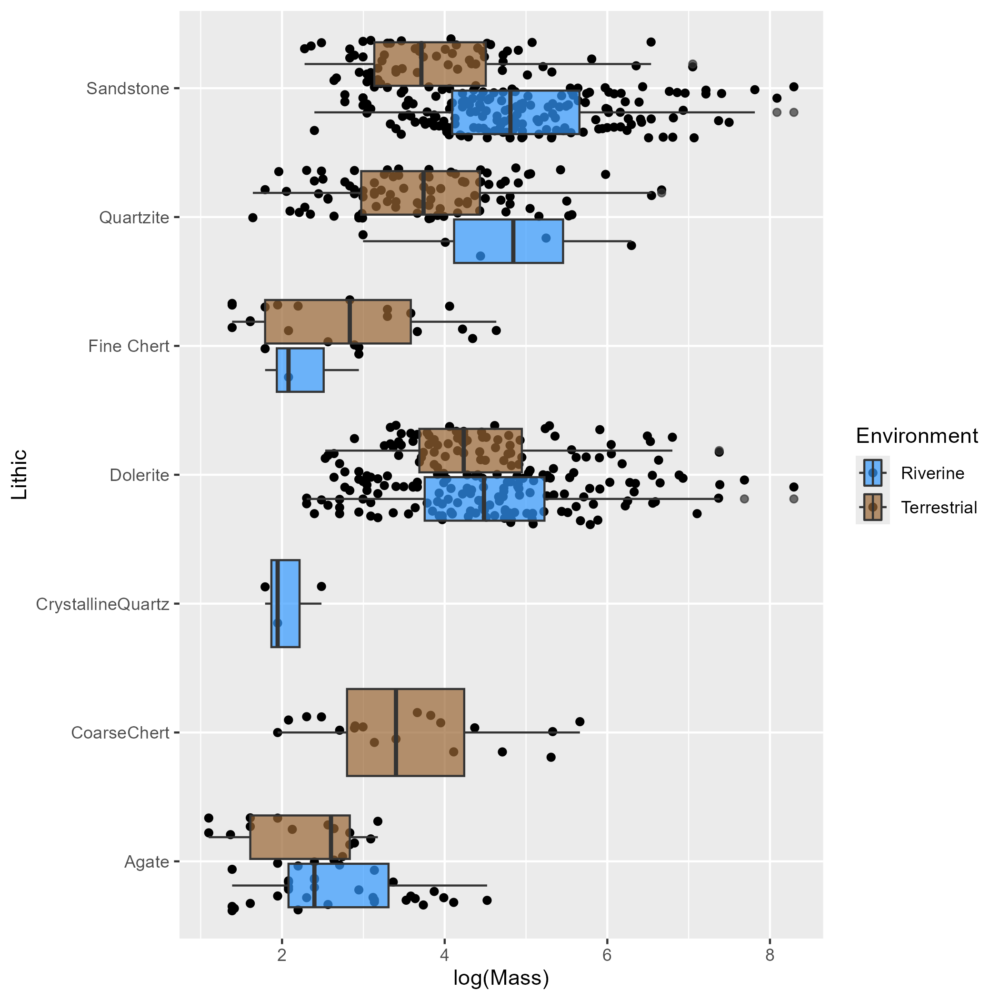

# lesotho-stone-resources
Map stone distribution and track mobility or prehistoric populations in Eastern Lesotho Highlands, southern Africa.

## Overview
This project uses frequentist analyses and regressions to model the relationship between toolstone materials and the distribution of these materials in the landscape.

## Tools Used
- R
- ggplot2, tidyverse

## Folder Structure
- 'data/': contains input data for the R-markdown document
- 'code/': contains R scripts for analysis
- 'results/': figures, tables, and output files
- 'docs/': rednered PDF document from R-markdown document
- 'requirements.txt': dependencies

## Key Results
- We find that past peoples at Sehonghong in Lesotho were not limited to exclusively riverine resources during colder conditions, but ventured out into the broader landscape for raw stone materaisl. Hence, resource procurement and mobility patterns are not solely dependent on climate change but may be driven by more complicated causal mechanisms such as increased social interaction and the formation of regional networks across the Lesotho highlands and beyond.

## Author
Alex Gregory
- PhD Candidate in Archaeology
https://github.com/Agregory198
